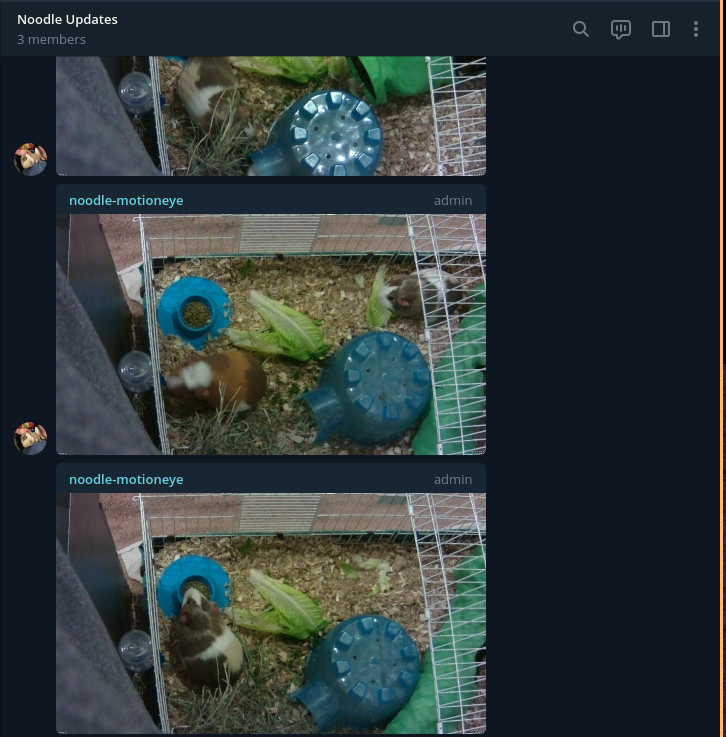

# Telegram MotionEye Integration

A stupid little project that takes pictures using a `Raspberry Pi Zero` every x minutes (or upon a motion REST request) from a [MotionEye OS](https://github.com/ccrisan/motioneyeos) camera and sends it to a Telegram Group.

# ...why?


So we can watch guinea pigs without having to completely expose a service or set up wireguard. Important stuff, written one bored afternoon.

# How

## Run
Easy:
1. Acquire guinea pigs, kids, or other things that need watching and make sure they are happy 
1. Install [MotionEye OS](https://github.com/ccrisan/motioneyeos) on a Raspberry PI and connect a camera; configure it so it sends motion detection is *on* and "Call a Web Hook" points to the server and port you're running this on (can be the same Raspberry, really)
1. Customize the `config/sample.yaml` (see below)
1. Build and run: `go run *.go serve --config ./config/sample.yaml`

## Config
You will need a `bot`, which you can get by chatting up [@BotFather](https://t.me/botfather) on Telegram.

Next, add that to a chanel.

Use your bot's `bot_name` and `api_key` from that chat.

Next, fire a request as such:
```
curl --location --request GET 'https://api.telegram.org/YOUR_BOT_KEY/getUpdates'
```

And grab the ID of the chanel you've added the bot to.

```
"my_chat_member": {
                "chat": {
                    "id": INT64_ID,
                    "title": "ID",
                    "type": "group",
                    ...
```

## Build & Test
```
go test ./... -coverprofile coverage.out
go tool cover --html coverage.out 
go build *.go
```